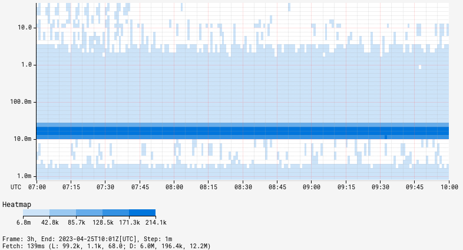

Atlas primarily supports visualizing data in line charts. As of 1.8, Atlas can also visualize
via heatmaps using the [`:heatmap`](../../api/graph/line-styles.md#heat-map) line style.
The graph area is broken up into a series of cells and a count for each cell is incremented when 
a measurement falls within the cells boundaries. Colors or shades of colors then fill in cells 
based on the final count.

## Percentiles
Heatmaps are particularly useful on top of
[percentile](../../spectator/patterns/percentile-timer.md) metrics to analyze the entire
measurement range. 

**Note** Using the [log linear](axis-scale.md#log-linear) scale will help to highlight clustered
regions of measurements via `&scale=log-linear`.
The example also uses data not available in the demo Atlas instance.

@@@ atlas-uri { hilite=:percentile-heatmap }
/api/v1/graph?e=2012-01-01T00:00&no_legend=1&q=name,requestLatency,:eq,:percentile-heatmap,&scale=log-linear
@@@

## Bounds

The `&heatmap_l=` and `&heatmap_u` parameters can be used to narrow the range of cells 
displayed in a heatmap. Heatmap bounds act on the _count_ of measurements in a cell and the
palette colors or shades chosen. Depending on the bound limits, some cells may appear empty.

@@@ atlas-example
No Heatmap Bounds: /api/v1/graph?e=2012-01-01T00:00&q=name,sps,:eq,(,nf.cluster,),:by,:heatmap
With Bounds (`&heatmap_l=1.2&heatmap_u=1.3`): /api/v1/graph?e=2012-01-01T00:00&q=name,sps,:eq,(,nf.cluster,),:by,:heatmap&heatmap_l=1.2&heatmap_u=1.3
@@@

## Palette

The palette used for filling heatmap cells can be changed via the `&heatmap_palette=` parameter.
By default, a color is chosen from the global palette (based on whether the heatmap is the 
first or a later expression). A gradient is then applied to that color with a lighter gradient
representing smaller cell counts and darker representing larger counts.

@@@ atlas-example
Default Palette: /api/v1/graph?e=2012-01-01T00:00&q=name,sps,:eq,(,nf.cluster,),:by,:heatmap
Reds Palette (`&heatmap_palette=reds`): /api/v1/graph?e=2012-01-01T00:00&q=name,sps,:eq,(,nf.cluster,),:by,:heatmap&heatmap_palette=reds
@@@

### Custom Palette

A custom palette may be provided by listing the hex colors to use in _descending_ order,
meaning the color to use for the highest cell counts must appear first.

@@@ atlas-uri { hilight=heatmap_palette }
/api/v1/graph?e=2012-01-01T00:00&q=name,sps,:eq,(,nf.cluster,),:by,:heatmap&heatmap_palette=(,8cd1b9,46adbc,2a91b8,1978b3,335ca9,413e95,361566,)
@@@

@@@ atlas-graph { show-expr=false }
/api/v1/graph?e=2012-01-01T00:00&q=name,sps,:eq,(,nf.cluster,),:by,:heatmap&heatmap_palette=(,8cd1b9,46adbc,2a91b8,1978b3,335ca9,413e95,361566,)
@@@

For further information, see [Custom Color Palettes](color-palettes.md#custom).

### Order of Expressions

When overlaying expressions with a heatmap and using the default palette, the order of 
expressions determines the color gradient used for cells. For example, if the heatmap
expression is second in the query, the second palette color will be used as the gradient:

@@@ atlas-example
Heatmap First: /api/v1/graph?e=2012-01-01T00:00&q=name,sps,:eq,(,nf.cluster,),:by,:heatmap,name,sps,:eq,
Heatmap Second: /api/v1/graph?e=2012-01-01T00:00&q=name,sps,:eq,name,sps,:eq,(,nf.cluster,),:by,:heatmap
@@@

## Label

The label for the heatmap can be changed via the `&heatmap_label=` parameter. By default, the
label is simply `heatmap`.

@@@ atlas-graph { show-expr=true }
/api/v1/graph?e=2012-01-01T00:00&q=name,sps,:eq,(,nf.cluster,),:by,:heatmap&heatmap_label=SPS%20Heatmap%20by%20Cluster
@@@

## Scale

Similar to axis scales, the scale of the heatmap cell colors (or gradients) can be adjusted
using the `&heatmap_scale=` parameter. By default, the scale is `linear` though any of the
valid scales may be used.

@@@ atlas-example
Linear: /api/v1/graph?e=2012-01-01T00:00&q=name,sps,:eq,(,nf.cluster,),:by,:heatmap
Log Linear: /api/v1/graph?e=2012-01-01T00:00&q=name,sps,:eq,(,nf.cluster,),:by,:heatmap&heatmap_scale=log-linear
@@@