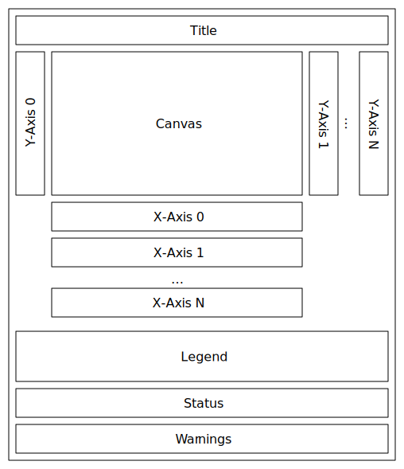
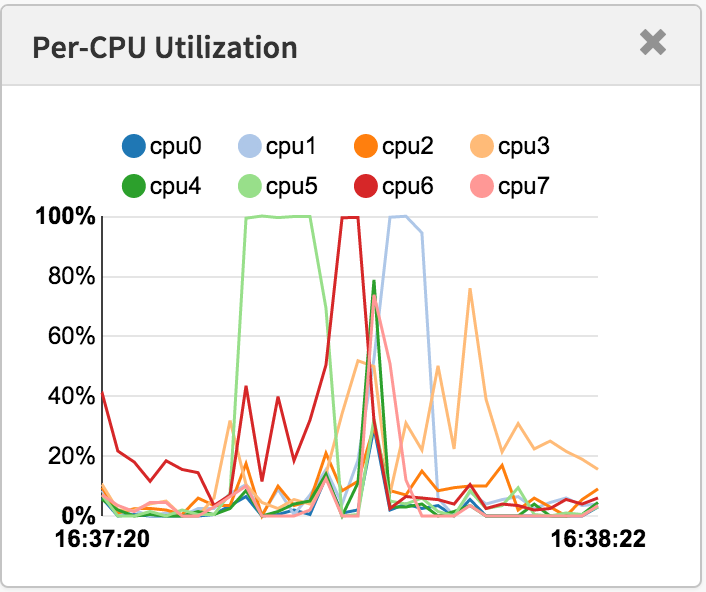
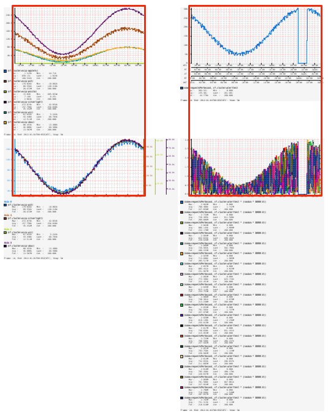
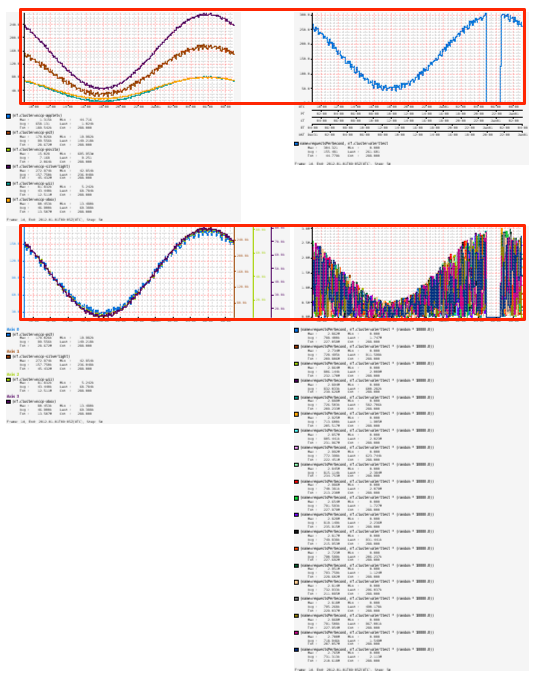

The diagram below shows the parts of an Atlas graph and will be used when describing
the behavior for various options.

{ width=450px }

The layout for graph images is trying to accomplish two main goals:

#### Usable Canvas Size

Keep the canvas usable regardless of the number of lines, axes, etc that are competing for space. For example, the canvas area should not become too small due to the number of lines on the chart.

|Good Layout|Poor Layout|
|-----------|-----------|
|||

#### Canvas Alignment

Make it easy to align the canvas portion of several graphs on an html page. This is important because it makes it easier to find visual correlations between multiple graphs on a dashboard.

In particular if arranged in a grid with the image in the top left of each cell, then the canvas should line up vertically for columns:

And horizontally for rows:

In the graph layout diagram at the top, this is why variable components such as multi axes, legend entries, and warnings are positioned on either the right side or the bottom of the canvas.

## Modes

There are four supported layout modes that can be used with the [layout query parameter](graph.md#image-size):

* `canvas`: the width or height are for the canvas component within the chart. The actual image size will be calculated based on the number of entries in the legend, number of axes, etc. This is the default behavior.
* `image`: the width or height are for the final image not including the zoom parameter. To try and adhere to layout goals when using this mode everything below the X-axes will automatically be suppressed. Vertical alignment will still hold as long as all graphs use the same number of Y-axes. Horizontal alignment will still hold as long as all graphs use the same number of X-axes.
* `iw`: use exact image sizing for the width and canvas sizing for the height.
* `ih`: use exact image sizing for the height and canvas sizing for the width.

## Examples

### Canvas

@@@ atlas-uri { hilite=layout }
/api/v1/graph?e=2012-01-01T09:00&h=175&layout=canvas&q=name,sps,:eq,:sum,(,nf.cluster,),:by&s=e-1d&tz=UTC&w=400
@@@

@@@ atlas-graph { show-expr=false }
/api/v1/graph?e=2012-01-01T09:00&h=175&layout=canvas&q=name,sps,:eq,:sum,(,nf.cluster,),:by&s=e-1d&tz=UTC&w=400
@@@

### Image

@@@ atlas-uri { hilite=layout }
/api/v1/graph?e=2012-01-01T09:00&h=175&layout=image&q=name,sps,:eq,:sum,(,nf.cluster,),:by&s=e-1d&tz=UTC&w=400
@@@

@@@ atlas-graph { show-expr=false }
/api/v1/graph?e=2012-01-01T09:00&h=175&layout=image&q=name,sps,:eq,:sum,(,nf.cluster,),:by&s=e-1d&tz=UTC&w=400
@@@

### Image Width

@@@ atlas-uri { hilite=layout }
/api/v1/graph?e=2012-01-01T09:00&h=175&layout=iw&q=name,sps,:eq,:sum,(,nf.cluster,),:by&s=e-1d&tz=UTC&w=400
@@@

@@@ atlas-graph { show-expr=false }
/api/v1/graph?e=2012-01-01T09:00&h=175&layout=iw&q=name,sps,:eq,:sum,(,nf.cluster,),:by&s=e-1d&tz=UTC&w=400
@@@

### Image Height

@@@ atlas-uri { hilite=layout }
/api/v1/graph?e=2012-01-01T09:00&h=175&layout=ih&q=name,sps,:eq,:sum,(,nf.cluster,),:by&s=e-1d&tz=UTC&w=400
@@@

@@@ atlas-graph { show-expr=false }
/api/v1/graph?e=2012-01-01T09:00&h=175&layout=ih&q=name,sps,:eq,:sum,(,nf.cluster,),:by&s=e-1d&tz=UTC&w=400
@@@
