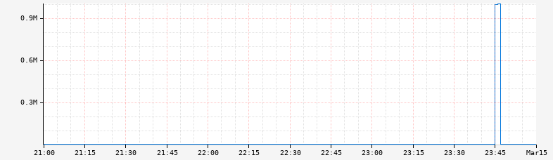

@@@ atlas-signature
maxValue: Double
expr: TimeSeriesExpr
-->
TimeSeriesExpr
@@@

Limit the maximum value of a time series by clamping values above a specified threshold.
Any values greater than the maximum will be set to the maximum value, while values at or
below the maximum remain unchanged. This is useful for controlling visualization scaling
and handling occasional data spikes.

## Parameters

* **expr**: The time series expression to apply the maximum limit to
* **maxValue**: The maximum allowed value (values above this will be clamped)

## Behavior

* **Values ≤ maxValue**: Remain unchanged
* **Values > maxValue**: Are set to exactly maxValue
* **Missing data**: NaN values are preserved as NaN

## Problem and Solution

The axis parameters for controlling [axis bounds](../../api/graph/axis-bounds.md) have limitations:

- They apply to everything on the axis and cannot target specific lines
- For data with occasional spikes, they can hide important details in the rest of the data

Consider this graph with a data spike:

The spike makes it difficult to see details at other times. While alternate [axis scales](../../api/graph/axis-scale.md)
like [logarithmic](../../api/graph/axis-scale.md#logarithmic) can help, linear scales are often easier to reason about.

Using `:clamp-max` to limit to a known reasonable maximum (e.g., 25) improves readability:

## Examples

Clamping to prevent spikes from dominating the scale:

@@@ atlas-example { hilite=:clamp-max }
Before: /api/v1/graph?w=200&h=125&s=e-3h&e=2012-01-01T07:00&tz=UTC&q=name,sps,:eq,:sum
After: /api/v1/graph?w=200&h=125&s=e-3h&e=2012-01-01T07:00&tz=UTC&q=name,sps,:eq,:sum,60e3,:clamp-max
@@@

## Related Operations

* [:clamp-min](clamp-min.md) - Limit minimum values (floor operation)

## See Also

* [Axis Bounds](../../api/graph/axis-bounds.md) - Global axis scaling options
* [Axis Scale](../../api/graph/axis-scale.md) - Alternative approaches for handling extreme values