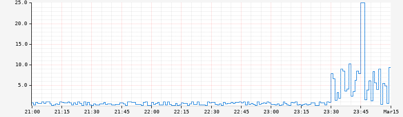

@@@ atlas-signature
Query
Double
-->
TimeSeriesExpr
@@@

Restricts the maximum value of the output time series to the specified value. Values
from the input time series that are less than or equal to the maximum will not be
changed.

A common use-case is to allow for auto-scaled axis up to a specified bound. The
axis parameters for controlling the [axis bounds](../../api/graph/axis-bounds.md) have the following
limitations:

- They apply to everything on the axis and cannot be targeted to a specific line.
- Are either absolute or set based on the data. For data with occasional spikes
  this can hide important details.

Consider the following graph:

The spike makes it difficult to make out any detail for other times. One option
to handle this is to use an alternate [axis scale](../../api/graph/axis-scale.md) such as
[logarithmic](../../api/graph/axis-scale.md#logarithmic) that gives a higher visual weight to the smaller
values. However, it is often easier for a user to reason about a linear scale, in
particular, for times when there is no spike in the graph window. If there is a known
max reasonable value, then the `:clamp-max` operator can be used to restrict the line
if and only if it exceeds the designated max. For example, if we limit the graph above
to 25:

@@@ atlas-example { hilite=:clamp-max }
Before: /api/v1/graph?w=200&h=125&s=e-3h&e=2012-01-01T07:00&tz=UTC&q=name,sps,:eq,:sum
After: /api/v1/graph?w=200&h=125&s=e-3h&e=2012-01-01T07:00&tz=UTC&q=name,sps,:eq,:sum,60e3,:clamp-max
@@@