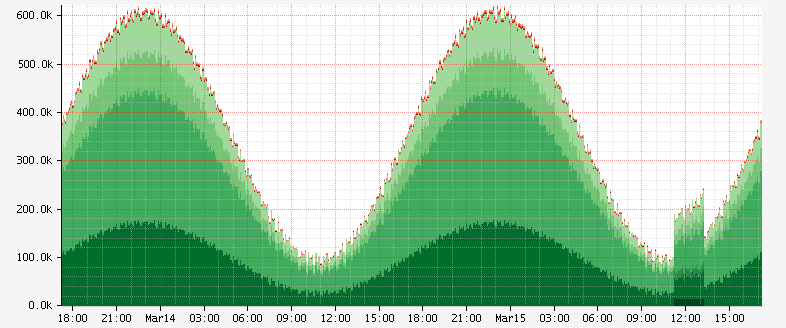

@@@ atlas-signature
paletteName: String
expr: TimeSeriesExpr
-->
StyleExpr
@@@

Set the color palette to use for automatically assigning colors to multiple time series.
This operator allows scoping a palette to a specific expression group rather than applying
it to all lines on the same axis. This is particularly useful when combining multiple
grouped expressions that should use different color themes.

## Parameters

* **expr**: The time series expression to apply the palette to
* **paletteName**: Name of the color palette (see available palettes below)

## Common Use Case

A typical scenario is creating graphs that show successful requests in green shades and
errors in red shades. This visual distinction makes it easy to identify whether changes
are due to increased errors or increased successful traffic:

**Spike in Errors:**

**Spike in Success:**

## Examples

Applying a red palette to a single time series:

@@@ atlas-example { hilite=:palette }
Before: /api/v1/graph?w=200&h=125&s=e-3h&e=2014-02-20T15:01&tz=US/Pacific&q=name,sps,:eq,:sum
After: /api/v1/graph?w=200&h=125&s=e-3h&e=2014-02-20T15:01&tz=US/Pacific&q=name,sps,:eq,:sum,reds,:palette
@@@

Applying a palette to grouped time series:

@@@ atlas-example { hilite=:palette }
Before: /api/v1/graph?w=200&h=125&s=e-3h&e=2014-02-20T15:01&tz=US/Pacific&q=name,sps,:eq,:sum,(,nf.cluster,),:by
After: /api/v1/graph?w=200&h=125&s=e-3h&e=2014-02-20T15:01&tz=US/Pacific&q=name,sps,:eq,:sum,(,nf.cluster,),:by,reds,:palette
@@@

## Related Operations

* [:color](color.md) - Set specific colors for individual series
* [:by](by.md) - Group data that benefits from palette application
* [:stack](stack.md) - Stack areas with different palette colors
* [:alpha](alpha.md) - Adjust transparency of palette colors

## See Also

* [Color Palettes](../../api/graph/color-palettes.md) - Complete list of available palettes