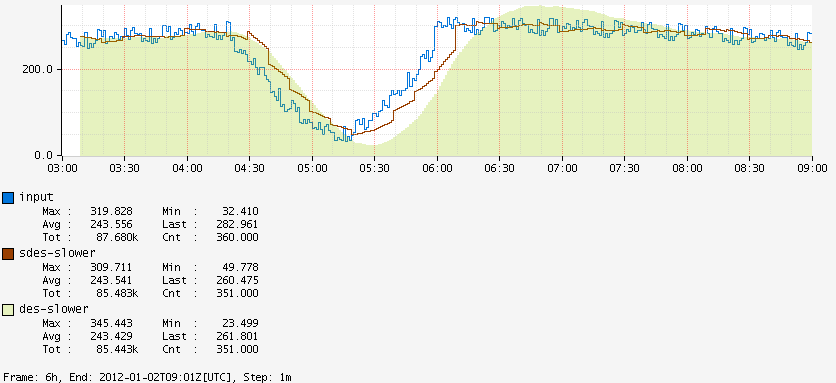
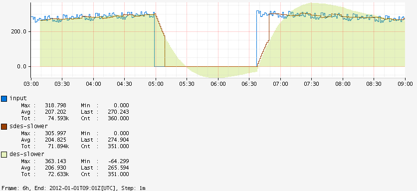

@@@ atlas-signature
beta: Double
alpha: Double
training: Int
TimeSeriesExpr
-->
TimeSeriesExpr
@@@

Variant of [:des](des.md) that is deterministic as long as the step size does not
change. One of the common complaints with DES is that to get the same value for a given
time you must start feeding in data at exactly the same time. So for normal graphs
where it is computed using the window of the chart it will have slightly different
predictions for a given time. As it is often used for alerting this makes it
cumbersome to try and determine:

1. Why an alarm fired
2. When alarms would have fired for tuning

Sliding DES uses two DES functions and alternates between them. One will get trained
while the other is getting used, and then the one that was getting used will get reset and
the roles swapped.

```
 F1 | A |-- T1 --|-- P1 --|-- T1 --|-- P1 --|-- T1 --|
 F2 | A |        |-- T2 --|-- P2 --|-- T2 --|-- P2 --|

Result:

 R  |-- NaN -----|-- P1 --|-- P2 --|-- P1 --|-- P2 --|
```

Both functions will ignore any data until it reaches a boundary, even multiple, of the
training window. That is shown as `A` in the diagram above. The first function will
then start training, `T1`, and after the training window the first predicted values, `P1`,
will get generated. The ouput line will alternate between the predictions from both
DES functions.

The alternation between functions can cause the prediction line to look choppier than
DES, e.g., on a gradual drop:



Further, since each prediction only considers data for a narrow window it will adjust to
sharp changes faster. For example:



Since: 1.5.0

@@@ atlas-example { hilite=:sdes }
Before: /api/v1/graph?w=200&h=125&s=e-3h&e=2012-01-01T07:00&tz=UTC&q=name,requestsPerSecond,:eq,:sum,:per-step
After: /api/v1/graph?w=200&h=125&s=e-3h&e=2012-01-01T07:00&tz=UTC&q=name,requestsPerSecond,:eq,:sum,5,0.1,0.5,:sdes
@@@