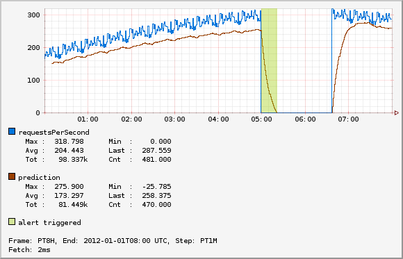
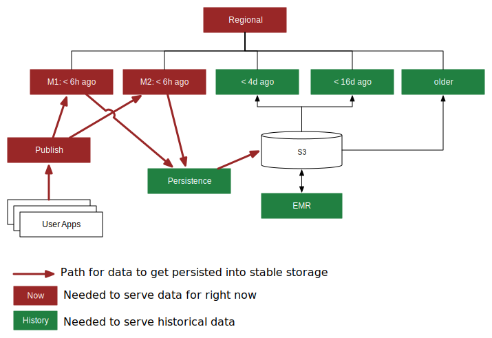
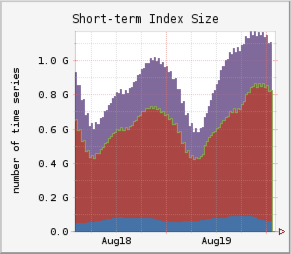
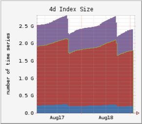
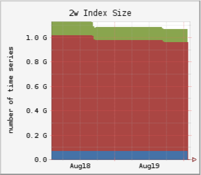

Atlas is the system Netflix uses to manage dimensional time-series data for near real-time
operational insight. It was primarily created to address issues with scale and query capability
in the previous system.

## History

In May of 2011, Netflix was using a home-grown solution called Epic to manage time-series data.
Epic was a combination of perl CGI scripts, RRDTool logging, and MySQL. We were tracking around
2M distinct time series and the monitoring system was regularly failing to keep up with the volume
of data. In addition there were a number of trends in the company which presaged a drastic
increase in metric volume:

* Rolling pushes to [Red/Black deployments](http://techblog.netflix.com/2012/06/asgard-web-based-cloud-management-and.html).
* Leveraging [auto-scaling for large clusters](http://techblog.netflix.com/2012/01/auto-scaling-in-amazon-cloud.html).
  Netflix has always used auto-scaling groups in AWS, but initially most were configured with fixed
  size and just used as a group and to replace instances.
* Expansion internationally into [Latin America](http://blog.netflix.com/2011/07/netflix-is-coming-to-latin-america.html)
  and [Europe](http://ukirelandblog.netflix.com/2012_01_01_archive.html). This led to an increase
  in the number of countries being tracked for key metrics and for Europe it was the first move
  into additional AWS regions. With additional regions we also wanted to have better isolation so
  a problem with monitoring in one region would not impact another, but at the same time have
  a mechanism to provide a global view if needed.

Since that time the metric volume has continued to grow quickly. The graph below shows the increase
in metrics measured over last few years:


The growth in raw volume required increased query capability to actually use the data.

## Goals

The main goals for Atlas were to build a system that provided:

* A Common API
* Scale
* Dimensionality

### Common API

Epic did a number of things really well that we didn't want to lose when transitioning. In particular:

* Normalization and consolidation
* Flexible legends that scale independently of the chart
* Math, especially handling of NaN values representing no data
* Holt-Winters used for alerting
* Visualization options
* Deep linking

Many of these are capabilities that are provided by the RRDTool library Epic was using, but most
alternatives we looked at fell short in these categories. In addition, we have uses for other 3rd
party services like CloudWatch and it is desirable to have common query capability for that data.

### Scale

As indicated in the history section, metrics volume was growing and we needed a system that could
keep up. For a long time our biggest concern was write volume, however, we also wanted to scale
in terms of the amount of data we could read or aggregate as part of a graph request.

### Dimensionality

This is a decision that was made because users were already doing it in ways that were hard to
support. Epic only support a simple name with some special case system dimensions of cluster and
node. Many users were creating names like:

```
com.netflix.eds.nccp.successful.requests.uiversion.nccprt-authorization.devtypid-101.clver-PHL_0AB.uiver-UI_169_mid.geo-US
```

That breaks down to:

| *Key* | *Value* |
|-------|---------|
| name  | com.netflix.eds.nccp.successful.requests.uiversion |
| nccprt | authorization |
| devtypid | 101 |
| clver | PHL_0AB |
| uiver | UI_169_mid |
| geo | US |

Since it was all mangled into a name with different conventions by team, users would have to resort
to complex regular expressions to slice and dice the data based on the dimensions.

## Query Layer

In order to get a common API, have flexibility for backend implementations, and provide merged
views across backends we built a query layer that can be hierarchically composed. The diagram below
shows the main Netflix setup:


We have isolated regional deployments in each region we operate in as well as a global deployment
that can combine the results from multiple regions. The query and aggregation operations can be
performed on the fan out so most of the big summarization operations will distribute the
computation across the tree and typically to an optimized storage layer at some point.

Allowing the query and rendering layer to work on multiple backends also makes it easier for us to
consider transitioning to other backends in the future such as OpenTSDB or InfluxDB. Switching to
Atlas one of the biggest hurdles was compatibility and transitioning to the new system.

### Stack Language

One of our key requirements was to be able to have deep links into a particular chart and to be
able to reliably pass around or embed these images via email, wikis, html pages, etc. In addition,
the user who receives the link should be able to tweak the result. Atlas uses a simple stack
language that has a minimal punctuation and allows arbitrarily complex graph expressions to be
encoded in a URL friendly way. This means that all images can be accessed using a GET request.
The stack language is also simple to parse and interpret, allowing it to be easily consumed from a
variety of tools. The core features include:

* Embedding and linking using a GET request
* URL friendly stack language
    * Few special symbols (comma, colon, parenthesis)
    * Easy to extend
* Basic operations
    * Query: and, or, equal, regex, has key, not
    * Aggregation: sum, count, min, max, group by
    * Consolidation: aggregate across time
    * Math: add, subtract, multiply, etc
    * Boolean: and, or, lt, gt, etc
    * Graph settings: legends, area, transparency

### Graph Example

To illustrate, this is a sample graph image:



This graph shows the number of requests per second and compares that with a prediction line
generated using [double exponential smoothing](DES). If the number of requests per second falls
below the prediction, it indicates an alert would trigger using the vertical spans. The url to
generate this image follows (newlines added for readability):

```
http://atlas/api/v1/graph
  ?tz=UTC
  &e=2012-01-01T08:00
  &s=e-8h
  &w=500
  &h=150
  &l=0
  &q=nf.cluster,alerttest,:eq,
     name,requestsPerSecond,:eq,:and,
     :sum,
     :dup,10,0.1,0.02,:des,
     0.85,:mul,
     :2over,:lt,
     :rot,$name,:legend,
     :rot,prediction,:legend,
     :rot,:vspan,60,:alpha,alert+triggered,:legend
```

Adding some comments to the stack expression to explain a bit what is going on:

```
# Query to generate the input line
nf.cluster,alerttest,:eq,
name,requestsPerSecond,:eq,:and,
:sum,

# Create a copy on the stack
:dup,

# Apply a DES function to generate a prediction
# using the copy on the top of the stack. For
# a description of the parameters see the DES
# reference page.
10,0.1,0.02,:des,

# Used to set a threshold. The prediction should
# be roughly equal to the line, in this case the
# threshold would be 85% of the prediction.
0.85,:mul,

# Before              After
# 4.                  4. actual
# 3.                  3. prediction
# 2. actual           2. actual
# 1. prediction       1. prediction
:2over,

# Create a boolean signal line that is 1
# for datapoints where the actual value is
# less than the prediction and 0 where it
# is greater than or equal the prediction.
# The 1 values are where the alert should
# trigger.
:lt,

# Apply presentation details.
:rot,$name,:legend,
:rot,prediction,:legend,
:rot,:vspan,60,:alpha,alert+triggered,:legend
```

See the [stack language] page for more information.

[stack langauge]: asl/tutorial.md

## Memory Storage

Storage for Atlas has been a bit of a sore point. We have tried many backends and ended up moving
more and more to a model where pretty much all data is stored in memory either in or off the java
heap.

### Speed

The primary goal for Atlas is to support queries over dimensional time series data so we can slice
and dice to drill down into problems. This means we frequently have a need to perform a large
aggregations that involve many data points even though the final result set might be small.

As an example consider a simple graph showing the number of requests per second hitting a service
for the last 3 hours. Assuming minute resolution that is 180 datapoints for the final output. On a
typical service we would get one time series per node showing the number of requests so if we have
100 nodes the intermediate result set is around 18k datapoints. For one service users went hog wild
with dimensions breaking down requests by device (~1000s) and country (~50) leading to about 50k
time series per node. If we still assume 100 nodes that is about 900M datapoints for the same 3h
line.

Though obviously we have to be mindful about the explosion of dimensions, we also want that where
possible to be a decision based on cost and business value rather than a technical limitation.

### Resilience

What all has to be working in order for the monitoring system to work? If it falls over what is
involved in getting it back up? Our focus is primarily operational insight so the top priority is
to be able to determine what is going on right now. This leads to the following rules of thumb:

* Data becomes exponentially less important as it gets older
* Restoring service is more important than preventing data loss
* Try to degrade gracefully

As a result the internal Atlas deployment breaks up the data into multiple windows based on the
window of data they contain.



With this setup we can show the last 6h of data as long as clients can successfully publish. The
data is all in memory sharded across machines in the 6h clusters. Because the data and index are
all in memory on the local node each instance is self contained and doesn't need any external
service to function. We typically run multiple mirrors of the 6h cluster so data is replicated and
we can handle loss of an instance. In AWS we run each mirror in a different zone so that a zone
failure will only impact a single mirror.

The publish cluster needs to know all of the instance in the mirror cluster and takes care of
splitting the traffic up so it goes to the correct shard. The set of mirror instances and shards
are assigned based on slots from the [Edda](https://github.com/Netflix/edda)
[autoScalingGroups API](https://netflix.github.io/edda/rest-api/#apiv2group). Since
the set of instances for the mirrors change rarely, the publish instances can cache the Edda
response and still retain successfully publish most data if Edda fails. If an instance is replaced
and we can't update data we would have partial loss for a single shard if the same shard was
missing in another mirror.

Historical data can also fail in which case graphs would not be able to show data for some older
windows. This doesn't have to be fully continuous, for example a common use case for us is to look
at week-over-week (WoW) charts even though the span of the chart might only be a few hours. If the
`< 4d` cluster fails but the `< 16d` cluster is functioning we could still serve that graph even
though we couldn't show a continuous graph for the full week. A graph would still be shown but
would be missing data in the middle.

After data is written to the mirrors, they will flush to a persistence layer that is responsible
for writing the data to the long term storage in S3. The data at full resolution is kept in S3 and
we use hadoop (Elastic MapReduce) for processing the data to perform corrective merging of data
from the mirrors, generate reports, and perform rollups into a form that can be loaded into the
historical clusters.

### Cost

Keeping all data in memory is expensive in-particular with the large growth rate of data. The
combination of dimensionality and time based partitioning used for resilience also give us a way
to help manage costs.

The first way is in controlling the number of replicas. In most cases we are using replicas for
redundancy not to provide additional query capacity. For historical data that can be reloaded from
stable storage we typically run only one replica as the duration of partial downtime was not deemed
to be worth the cost for an additional replica.

The second way is as part of the hadoop processing we can compute rollups so that we have a much
smaller data volume to load in historical clusters. At Netflix the typical policy is roughly:

| *Cluster* | *Policy* |
|-----------|----------|
| < 6h      | Keeps all data received |
| < 4d ago  | Keeps most data, we do early rollup by dropping the node dimension on some business metrics |
| < 16d ago | Rollup by dropping the node dimension on all metrics |
| older     | Explicit whitelist, typically recommend BI systems for these use-cases |

Using these policies we get greatly reduced index sizes for the number of distinct time series
despite a significant amount of churn. With auto-scaling and red/black deployment models the set
of instances change frequently so typically the intersection of distinct time series from one day
to the next is less than 50%. Rollups target the dimensions which lead to that churn giving us much
smaller index sizes. Also, in many cases dimensions like node that lead to this increase become
less relevant after the node goes away. Deep-dive or investigative use-cases can still access the
data using hadoop if needed.

Snapshot of index sizes for one region in our environment:

|  < 6h | < 4d | < 16d   |
|---|---|---|
|  |  |  |

## Ecosystem

Internally there is a lot of tooling and infrastructure built up around Atlas. We are
planning to open source many of these tools as time permits. This project is the first step for
that with the query layer and some of the in-heap memory storage. Some additional parts that should
come in the future:

* User interfaces
    * Main UI for browsing data and constructing queries.
    * Dashboards
    * Alerts
* Platform
    * Inline aggregation of reported data before storage layer
    * Storage options using off-heap memory and lucene
    * Percentile backend
    * Publish and persistence applications
    * EMR processing for computing rollups and analysis
    * Poller for SNMP, healthchecks, etc
* Client
    * Supports integrating servo with Atlas
    * Local rollups and alerting
* Analytics
    * Metrics volume report
    * [Canary analysis](http://www.infoq.com/presentations/canary-analysis-deployment-pattern)
    * Outlier and anomaly detection

These projects were originally developed and run internally and thus only needed to be setup by our
team and assume many internal infrastructure pieces to run. There is a goal to try and make this
easier, but it will take some time.