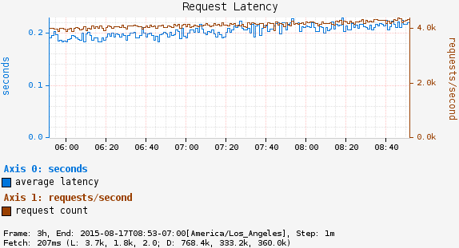

# Long Task Timer

Timer intended to track a small number of long running tasks. Example would be something like
a batch hadoop job. Though "long running" is a bit subjective the assumption is that anything
over a minute is long running.

A regular Timer just records the duration and has no information until the task is
complete.

As an example, consider a chart showing request latency to a typical web server. The expectation
is many short requests, so the timer will be getting updated many times per second.

Now consider a background process to refresh metadata from a data store. For example, Edda caches
AWS resources such as instances, volumes, auto-scaling groups etc. Normally, all data can be
refreshed in a few minutes. If the AWS services are having problems, it can take much longer. A
long duration timer can be used to track the overall time for refreshing the metadata.

The charts below show max latency for the refresh using a regular timer and a long task timer.
Regular timer, note that the y-axis is using a logarithmic scale:

Long Task Timer:

