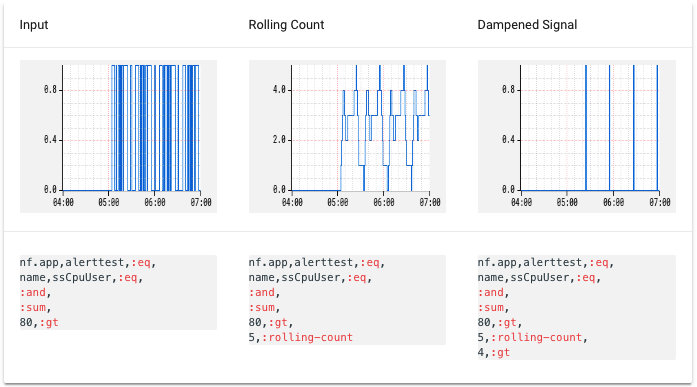
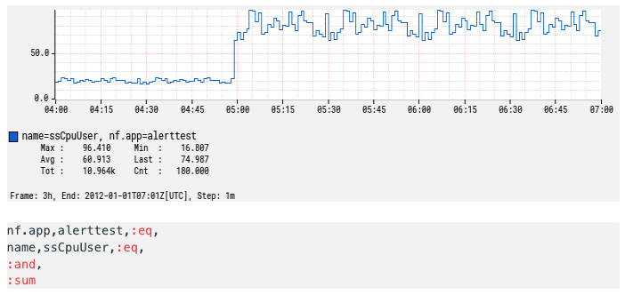
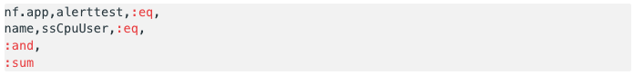

## Introduction

This is a custom [MkDocs plugin], which parses directives in Markdown source and replaces them
with either Atlas graphs or formatted Atlas expressions. These illustrations help to make Atlas
usage examples in the documentation more concrete.

[MkDocs plugin]: https://www.mkdocs.org/user-guide/plugins/

## Atlas Formatting Directives

### Atlas Example

Multiple input lines, each containing a column title and an Atlas graph URI, separated by a
`: ` delimiter.

This directive is used to illustrate how an Atlas expression is transformed across a series
of steps.

**Input:**

```
@@@ atlas-example
Input: /api/v1/graph?w=200&h=125&no_legend=1&s=e-3h&e=2012-01-01T07:00&tz=UTC&l=0&q=nf.app,alerttest,:eq,name,ssCpuUser,:eq,:and,:sum,80,:gt
Rolling Count: /api/v1/graph?w=200&h=125&no_legend=1&s=e-3h&e=2012-01-01T07:00&tz=UTC&l=0&q=nf.app,alerttest,:eq,name,ssCpuUser,:eq,:and,:sum,80,:gt,5,:rolling-count
Dampened Signal: /api/v1/graph?w=200&h=125&no_legend=1&s=e-3h&e=2012-01-01T07:00&tz=UTC&l=0&q=nf.app,alerttest,:eq,name,ssCpuUser,:eq,:and,:sum,80,:gt,5,:rolling-count,4,:gt
@@@
```

**Output:**



### Atlas Graph

A single line containing an Atlas graph URL, which will be rendered as a graph.

The Atlas expression may be optionally included as part of the output, formatted to improve
readability, with links to the Atlas StackLang Reference pages for each of the operators.

**Input:**

```
@@@ atlas-graph { show-expr=true }
/api/v1/graph?s=e-3h&e=2012-01-01T07:00&tz=UTC&l=0&h=100&q=nf.app,alerttest,:eq,name,ssCpuUser,:eq,:and,:sum
@@@
```

**Output:**



### Atlas StackLang

A single line containing an Atlas graph URI, which will be rendered as a formatted block
to improve readability, with links to the Atlas StackLang Reference pages for each of the
operators.

**Input:**

```
@@@ atlas-stacklang
/api/v1/graph?s=e-3h&e=2012-01-01T07:00&tz=UTC&l=0&h=100&q=nf.app,alerttest,:eq,name,ssCpuUser,:eq,:and,:sum
@@@
```

**Output:**




## Build

The Travis build uses the requirements file to install dependencies. The plugin will be installed
from the local directory in editable mode. When updating dependencies using `pip freeze`, make
sure that the reference to the plugin remains as follows:

```
-e plugins/mkdocs-atlas-formatting-plugin
```

## Development

Setup a local virtualenv, activate and serve the site:

```bash
./setup-venv.sh
source venv/bin/activate
mkdocs serve
```

Re-install the plugin as needed, to pick up the latest changes and allow testing to be correct:

```bash
pip install plugins/mkdocs-atlas-formatting-plugin
```

Run all plugin tests:

```bash
cd plugins/mkdocs-atlas-formatting-plugin
./run-tests.sh
```
